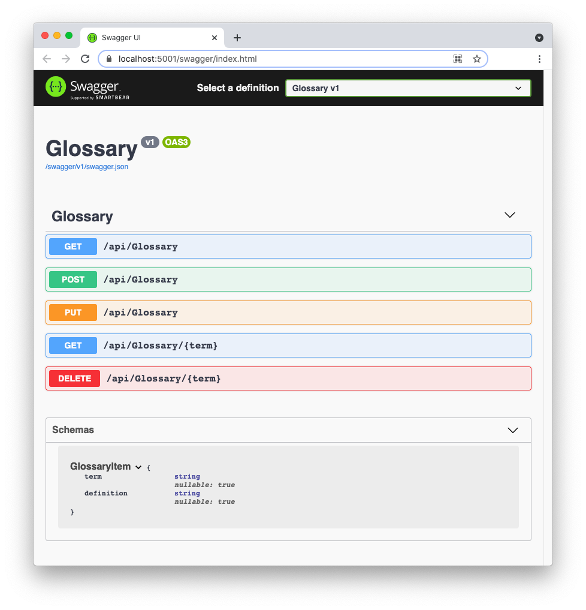

This repository contains a basic glossary CRUD Web API implemented in ASP.NET.

The following article describes the implementation details: [Tutorial: Building ASP.NET CRUD Web APIs](https://auth0.com/blog/building-aspnet-webapi/)

## To run this application:

1. Clone the repo with the following command: 

   ```bash
   git clone --branch starter --single-branch https://github.com/auth0-blog/glossary-web-api-aspnet.git
   ```

2. Move to the `glossary-web-api-aspnet` folder 

3. Type `dotnet run` in a terminal window to launch the Web API.

4. Point your browser to `https://localhost:5001/swagger` to test the available endpoints and actions.



## Requirements:

- [.NET Core SDK](https://dotnet.microsoft.com/download/dotnet/current) installed on your machine

